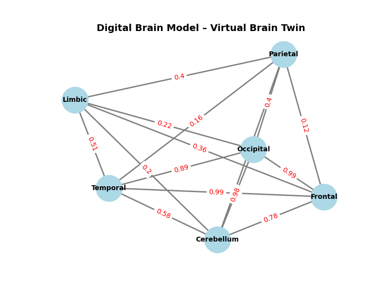
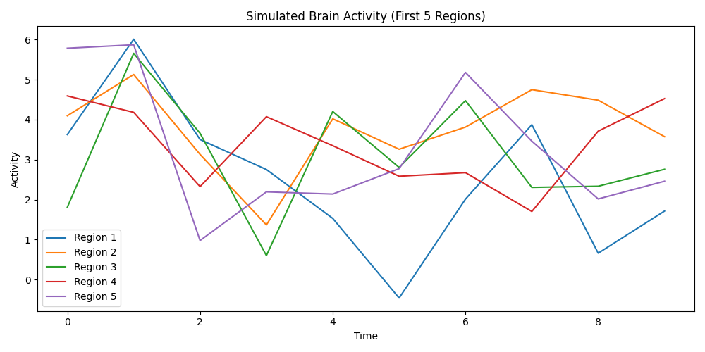
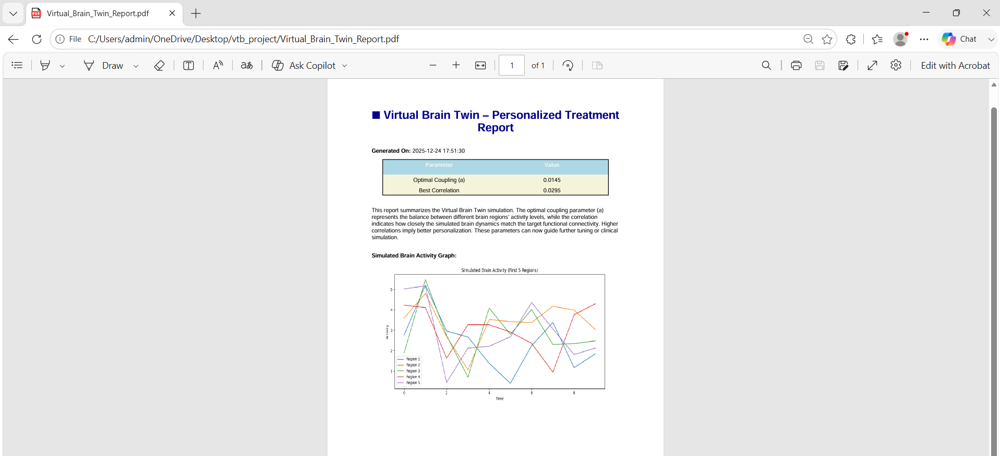

# 🧠 Virtual Brain Twin for Personalized Treatment of Psychiatric Disorders

A Python-based simulation project that creates a **Virtual Brain Twin** to model brain connectivity and activity for personalized treatment of psychiatric disorders. The project visualizes brain networks, compares healthy and psychiatric brain activity, generates 3D brain visualizations, and automatically creates a simulation report.

---

## ✨ Features

- 🧠 Virtual Brain Twin Simulation
- 📊 Brain Activity Visualization
- 🌐 3D Brain Activity Visualization
- 🔄 Healthy vs Psychiatric Brain Comparison
- 🕸️ Digital Brain Network Model
- 📄 Automatic PDF Report Generation

---

## 🛠️ Tech Stack

- Python
- The Virtual Brain (TVB)
- NumPy
- Matplotlib
- NetworkX
- ReportLab

---

## 📸 Project Outputs

### 🕸️ Digital Brain Network



---

### 📊 Simulated Brain Activity



---

### 🌐 3D Brain Activity Visualization


---

### 🔄 Healthy vs Psychiatric Brain Activity


---

### 📄 Generated Simulation Report



---

## 📂 Project Structure

```text
Virtual-Brain-Twin-for-Personalized-Treatment-of-Psychiatric-Disorders
│
├── main.py
├── compare_brains.py
├── digital_brain_model.py
├── digital_brain_visual.py
├── digital_brain_3d.py
├── generate_report.py
├── Virtual_Brain_Twin_Report.pdf
├── screenshots/
└── README.md
```

---

## ⚙️ Installation

Clone the repository

```bash
git clone https://github.com/23004513/Virtual-Brain-Twin-for-Personalized-Treatment-of-Psychiatric-Disorders.git
```

Move to the project folder

```bash
cd Virtual-Brain-Twin-for-Personalized-Treatment-of-Psychiatric-Disorders
```

Install dependencies

```bash
pip install numpy matplotlib networkx reportlab
```

Run the project

```bash
python main.py
```

---

## 🚀 Future Enhancements

- MRI-based patient-specific brain models
- AI-assisted treatment recommendations
- Real-time EEG integration
- Cloud deployment
- Advanced clinical simulation

---

## 👩‍💻 Author

**Navya Sree**

- GitHub: https://github.com/23004513
- LinkedIn: https://www.linkedin.com/in/nuthalapati-navya-sree-bb2268383
